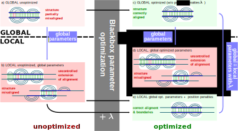

# Structure scoring effects for sankoff-like alignments

The idea is to invetigate structure scoring effects in sankoff-like alignments for local alignments. Local sequence alignments is known to have a negative expacted score. This negativ expacted score for randon sequences is needed to find the correct alignment boundarys and avoid any alignment-length score dependencies. 
Since the sturcture contribution for the score is almost always positive the score alignment-length dependence and the correct boundary detection would need to be investigated. 
This investigation is implemented by using a state of the art sankoff-like alignment LocARNA as a representatvie.



This reposetory contains:
- [Global and local alignment benchmarksets](./benchmark_sets)
- [Some test data to quickliy check code using a local benchmankset](./test_data)
- [A analysis of free enegrys of random an ncRNAs](./FreeEnergy_analysis)
- [Notebooks for plotting the results](./analysis_notebooks)
- [analysiz data for different parameter combinations](./data)
- [Figures used in the publication](./figure)
- [Shuffeling lib](./lib)
- [Skripts](./skripts)


### Parameter optimization

LocRNA paramters where optimized in the course of this investigation for global and local mode using SMAC, published by [Hutter et al.](https://ml.informatik.uni-freiburg.de/papers/11-LION5-SMAC.pdf), a blackbox optimization tool. 
Paramters where optimized for LocARNA running in global mode using position-wise penatly 0 (global-opt paramters), in local mode using position-wise penatly 0 (local-opt paramters) and in local mode using position-wise penatly 15 (local-opt-15 paramters). The last optimization shows that a position-wise penatly can counter act the structure bias of LocARNA scoring function. Consequently, the position-wise penalty allows the use of the same global optimized parameter running LocARNAs global or local mode. 


### Install LocARNA
Results of the publication fo the reposetory where computed using [LocRNA v2.0.0RC6](https://github.com/s-will/LocARNA/releases/tag/v2.0.0RC6)
This version can be installed using conda:
```
conda install locarna
```
### LocRNA calls using differen parameters

- globel mode LocRNA call using default parameters
```
  mlocarna --tgtdir /some/dir/ --max-diff-am -1 --min-prob 0.0005 
    --indel -350 --indel-opening -500 --struct-weight 200 --tau 0
    --write-structure 200 --pw-aligner-options "--pos-output
    --penalized=15 --sequ-local=off" input.fa --moreverbose -v
```

- local mode LocRNA call using default parameters
```
  mlocarna --tgtdir /some/dir/ --max-diff-am -1 --min-prob 0.0005 
    --indel -350 --indel-opening -500 --struct-weight 200 --tau 0
    --pw-aligner-options "--sequ-local on --penalize 0 
    --pos-output" --local-progressive input.fa --moreverbose -v
```

- globel mode LocRNA call using global-opt parameters
```
  mlocarna --tgtdir /some/dir/ --max-diff-am -1 --min-prob 0.0005 
    --indel -68 --indel-opening -807 --struct-weight 200 --tau 72
    --write-structure 200 --pw-aligner-options "--pos-output 
    --penalized=0 --sequ-local=off" input.fa --moreverbose -v
```

-local mode LocRNA call using local-opt parameters
```
   mlocarna --tgtdir /some/dir/ --max-diff-am -1 --min-prob 0.0005 
   --indel -136 --indel-opening -975 --struct-weight 115 --tau 38
   --pw-aligner-options "--sequ-local on --penalize 0 
   --pos-output" --local-progressive input.fa --moreverbose -v
```

- local mode LocRNA call using global-opt parameters and
position-wise penalty 15:
```
  mlocarna --tgtdir /some/dir/ --max-diff-am -1 --min-prob 0.0005 
    --indel -68 --indel-opening -807 --struct-weight 200 --tau 72
    --pw-aligner-options "--sequ-local on --penalize 15 
    --pos-output" --local-progressive input.fa --moreverbose -v
```


